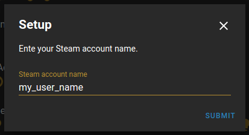
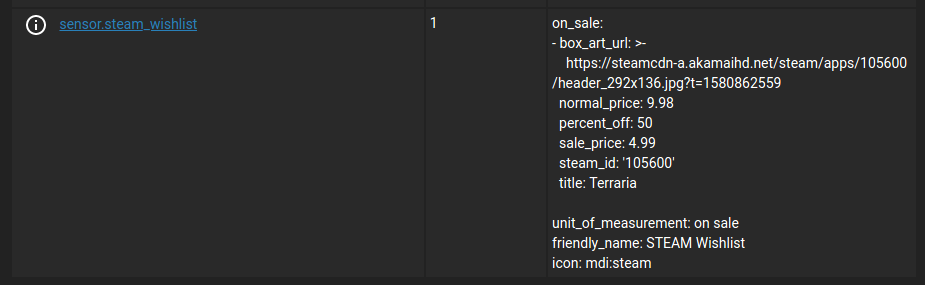
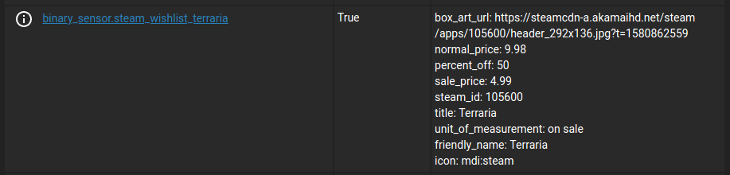

# Steam Wishlist for Home Assistant

A custom component that keeps track of when games on your Steam wishlist are on
sale.  This component uses the config flow and can easily be configured via the
Integrations section in the UI.

## HACS Installation

1. Search for `Steam Wishlist` under the `Integrations` tab on [HACS](https://hacs.xyz/).
2. Install the integration and restart home assistant.
3. In the home assistant configuration screen click on `Integrations`.
4. Click on the `+` icon to add a new integration.
5. Search for `Steam Wishlist` and select it.
6. Enter your steam account name and click `Submit`.

## Manual Installation
1. Download the [latest release](https://github.com/boralyl/steam-wishlist/releases).
2. Extract the files and move the `steam_wishlist` folder into the path to your
   `custom_components`.  e.g. `/config/custom_components`.
3. In the home assistant configuration screen click on `Integrations`.
4. Click on the `+` icon to add a new integration.
5. Search for `Steam Wishlist` and select it.
6. Enter your steam account name and click `Submit`.

## Sensors

After you successfully setup the integration a number of sensors will be created.

### `sensor.steam_wishlist`

This sensor will report the number of games on sale from your wishlist.

#### Attributes

|attribute|description|
|-|-|
|on_sale|An array of [games on sale](#attributes-1).|

### `binary_sensor.steam_wishlist_<title>`

A binary sensor will be created for each game on your wishlist.  It's state will
indicate if it is on sale or not.

#### Attributes

|attribute|description|
|-|-|
|box_art_url|The URL for the box art of the game.|
|normal_price|The normal price of the game.|
|sale_price|The sale price of the game.|
|percent_off|The percentage off of the normal price.|
|steam_id|The Steam ID of the game.|
|title|The title of the game.|
